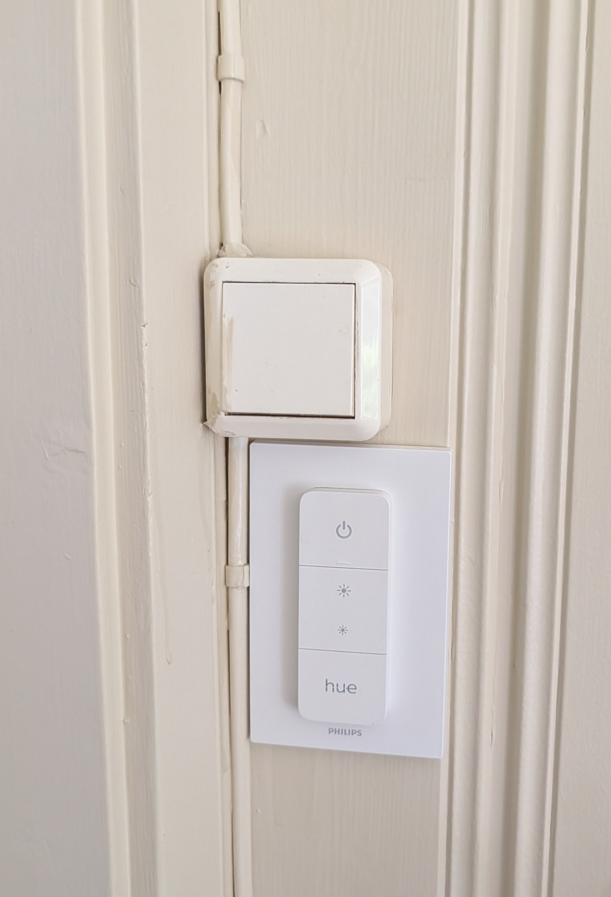
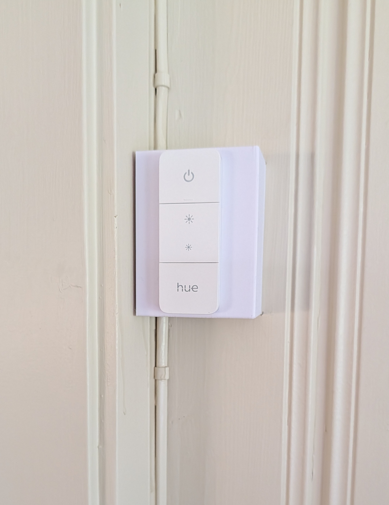
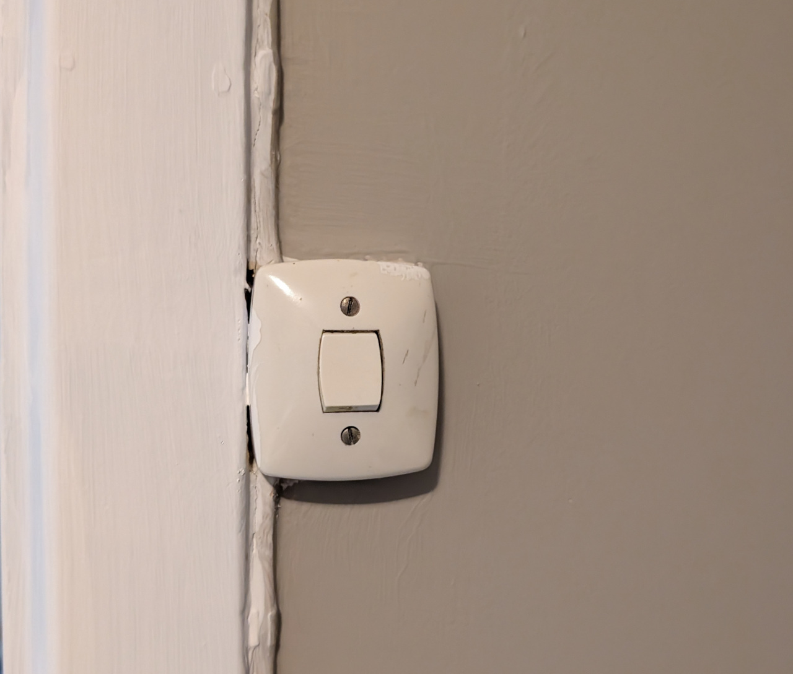
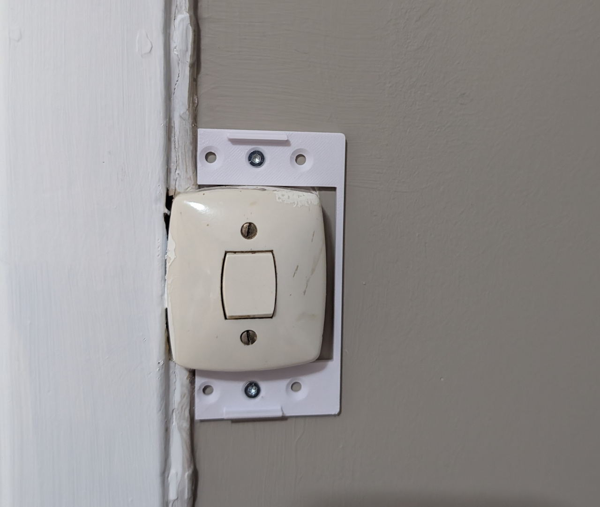
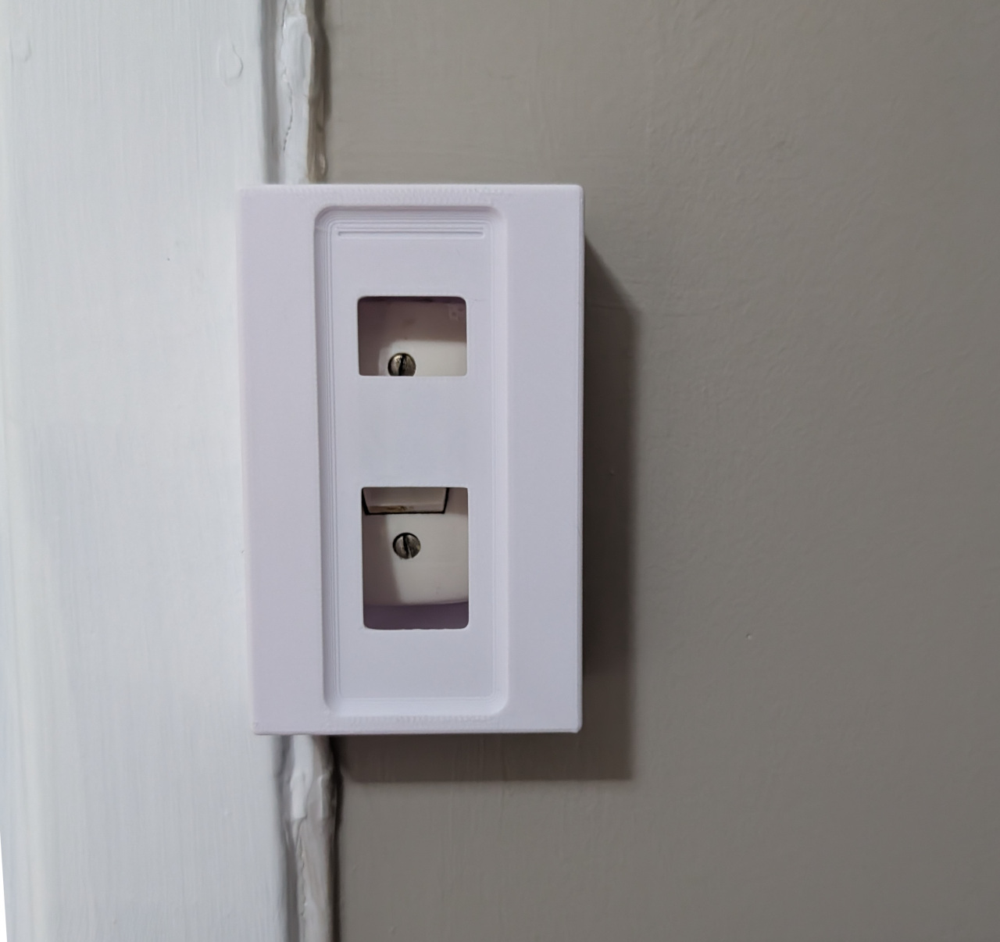
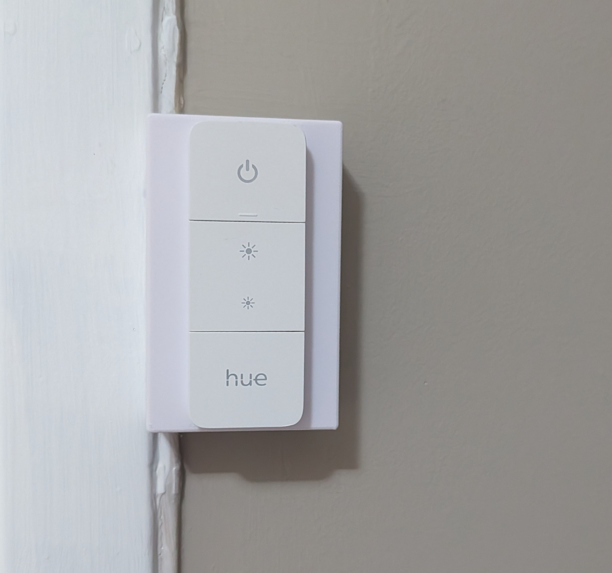

# Parametric Hue Buttons light switch cover

Does you house too look like this?

<table>
  <tr>
    <td></td>
    <td></td>
  </tr>
  <tr>
    <td align="center">Before</td>
    <td align="center">After</td>
  </tr>
</table>

Then this might be for you.

This is a parametric generator for a Philips Hue buttons holder to cover over original light switches.

To hold the Hue buttons in place, magnets or some metal need to be glued to the back of the magnet holder strip. I use double sided tape for this so far with a couple of 9mm magnets, but a bit of metal like on the original holders from Philips should also work well, like a washer. If you use magnets, make sure to get the polarization right before gluing them on, the Hue buttons have two internal magnets with opposing polarization.

## Features

* Parametric to allow for cables and door frame cutouts, and a variety of switch sizes
* Poke-through hole behind the Hue buttons to allow access to the old switch when needed
* Wall mount can be fastened with screws or double sided tape
  * **If your cables are hidden, I recommend using tape**

## Parameters

* Size of underlying box
* Cable cutouts for each corner
* Removal of walls on either side for buttons that are placed in corners
* Door frame cutout on either side for buttons next to door frames

## Full assembly example

<table>
  <tr>
    <td></td>
    <td></td>
    <td></td>
    <td></td>
  </tr>
  <tr>
    <td align="center">Old switch</td>
    <td align="center">Backplate mounted</td>
    <td align="center">Cover mounted</td>
    <td align="center">Hue buttons attached</td>
  </tr>
</table>
